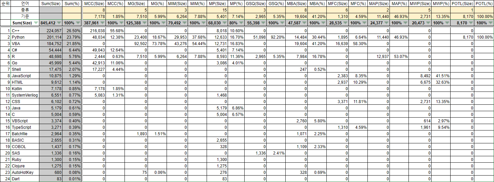
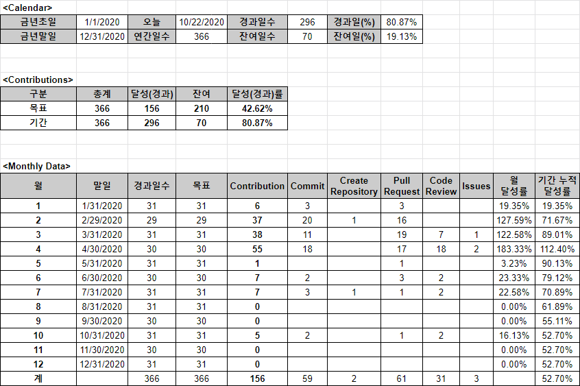

# [Github Statistics](/README.md#※-github-statistics)

Manufacture *Github* user statistics by its REST API and crawling


### \<List>

- [Python : Get Daily Contribution Data by Crawling (2023.12.31)](#python--get-daily-contribution-data-by-crawling-20231231)
- [TypeScript : List a User's Repositories (2023.10.26)](#typescript--list-a-users-repositories-20231026)
- [Google Sheet : Most Used Languages (2023.10.25)](#google-sheet--most-used-languages-20231025)
- [Google Sheet : Dashboard Outline (2020.04.19)](#google-sheet--dashboard-outline-20200419)


## [Python : Get Daily Contribution Data by Crawling (2023.12.31)](#list)

- Retrieves, scrapes, and saves daily contribution data from a GitHub profile for a specified year
  1. `retrieve_daily_contributions()` scrapes the daily contribution data for a given GitHub user and year.
  2. `save_csv()` saves the collected data as a CSV file.
- Future Improvements
  - Analyze periodic trends
- Target URL to be crawled
  ```url
  https://github.com/{username}
  ```
- Usage
  ```py
  USERNAME = "{username}"
  contributions_data = retrieve_daily_contributions(username=USERNAME, year={year})
  ```
- Codes and Results
  <details>
    <summary>get_github_daily_contributions.py</summary>

  ```py
  import datetime
  import pytz
  import requests
  from bs4 import BeautifulSoup
  import pandas as pd
  ```
  ```py
  TEST = True
  ```
  ```py
  def retrieve_daily_contributions(username: str, year: int = 0) -> pd.DataFrame:
      """
      Retrieve daily contribution data from a GitHub profile for a specific year.

      Args:
          username (str): GitHub username or ID
          year (int): Year for which contributions are to be retrieved (default: 0 for the current year)

      Returns:
          DataFrame: DataFrame containing the daily contribution data
      """

      # URL 설정
      current_year = datetime.datetime.now().year
      if 2000 < year <= current_year:
          year_str = str(year)
          url = f"https://github.com/{username}?from={year_str}-01-01&to={year_str}-12-31"
      else:
          url = f"https://github.com/{username}"
      if TEST:
          print("URL:", url, "\n")

      daily_contributions = []

      try:
          response = requests.get(url, timeout=3)
          soup = BeautifulSoup(response.text, "html.parser")
          table = soup.find("table", class_="ContributionCalendar-grid js-calendar-graph-table")
          if table:
              td_list = table.select("tbody > tr > td")

              # <td tabindex="0" data-ix="0" aria-selected="false" aria-describedby="contribution-graph-legend-level-4" style="width: 10px" data-date="2023-01-01" id="contribution-day-component-0-0" data-level="4" role="gridcell" data-view-component="true" class="ContributionCalendar-day"></td>
              # <tool-tip id="tooltip-e4f9e24e-d9ec-4ee3-ad3c-c2265e892038" for="contribution-day-component-0-0" popover="manual" data-direction="n" data-type="label" data-view-component="true" class="sr-only position-absolute">5 contributions on January 1st.</tool-tip>
              # ……

              for td in td_list:
                  if td.name == "td" and "data-date" in td.attrs:
                      data_date = td["data-date"]
                      tooltip = td.find_next_sibling("tool-tip")
                      tooltip_id = ""
                      if tooltip:
                          tooltip_id = tooltip["for"]
                          tooltip_text = tooltip.text.split(' ')[0]
                          num_contributions = int(tooltip_text) if tooltip_text.isdigit() else 0
                      else:
                          num_contributions = 0

                      validation = tooltip_id == td["id"]
                      daily_contributions.append([data_date, num_contributions, validation])

      except requests.RequestException as e:
          print(f"Failed to retrieve data: {e}")
          daily_contributions.append(["Failed", "Failed", "Failed"])

      columns = ["Date", "Contributions", "Validation"]
      df = pd.DataFrame(data=daily_contributions, columns=columns)

      return df
  ```
  ```py
  def save_csv(data_frame, filename="github_daily_contributions"):
      """
      Save DataFrame as a CSV file.

      Args:
          data_frame (DataFrame): DataFrame to be saved
          filename (str): Name of the output file (default: github_daily_contributions)
      """
      seoul_timezone = pytz.timezone('Asia/Seoul')
      timestamp = datetime.datetime.now(seoul_timezone).strftime("%Y%m%d_%H%M%S")
      path = f"Data/{filename}_{timestamp}.csv"
      data_frame.to_csv(path, index=False, encoding='utf-8-sig')
      print("File saved successfully:", path)
  ```
  ```py
  if __name__ == "__main__":
      # Example usage:
      USERNAME = "kimpro82"
      contributions_data = retrieve_daily_contributions(username=USERNAME, year=2023)
      print(contributions_data)

      save_csv(contributions_data)
  ```
  </details>
  <details open="">
    <summary>Console Output</summary>

  ```py
            Date  Contributions  Validation
  0    2023-01-01              5        True
  1    2023-01-08              1        True
  2    2023-01-15              1        True
  3    2023-01-22              4        True
  4    2023-01-29              0        True
  ..          ...            ...         ...
  360  2023-12-02              0        True
  361  2023-12-09              6        True
  362  2023-12-16              2        True
  363  2023-12-23              5        True
  364  2023-12-30              4        True

  [365 rows x 3 columns]
  File saved successfully: Data/github_daily_contributions_20240101_003651.csv
  ```
  </details>


## [TypeScript : List a User's Repositories (2023.10.26)](#list)

- Fetch information about a *GitHub* user's repositories using the *GitHub API* and extracts relevant data
- Future Improvements
  - Also retrieve language statistics for each repository and combine them
  - Display the data using an SVG image
- REST API URL
  ```url
  https://api.github.com/users/{username}/repos
  ```
- Usage
  ```bash
  node GetGithubUserStats.js {username}
  ```
- Codes and Results
  <details>
    <summary>GetGithubUserStats.ts</summary>

  ```ts
  import axios from 'axios';
  ```
  ```ts
  /**
   * Fetches the repositories of a GitHub user.
   *
   * @param {string} username - The GitHub username to fetch repositories for.
   * @returns {Promise<any[]>} - A promise that resolves with an array of repositories.
   */
  async function fetchUserRepos(username: string): Promise<any[]> {
      try {
          // GitHub API URL
          const apiUrl = `https://api.github.com/users/${username}/repos`;

          // Send a GET request to the GitHub API
          const response = await axios.get(apiUrl);

          // Check if the request was successful
          if (response.status === 200) {
              return response.data; // Array of repositories
          } else {
              throw new Error('Failed to fetch user repositories.');
          }
      } catch (error) {
          console.error('Error:', error.message);
          return [];
      }
  }
  ```
  ```ts
  /**
   * Extracts relevant information from GitHub repositories.
   *
   * @param {any[]} repos - An array of GitHub repositories.
   * @returns {any[]} - An array of extracted information.
   */
  function extractRepoInfo(repos: any[]): any[] {
      const extractedData = repos.map((repo) => ({
          name: repo.name,
          isPrivate: repo.private, // 'private' is a reserved word in strict mode
          fork: repo.fork,
          size: repo.size,
          language: repo.language,
      }));

      return extractedData;
  }
  ```
  ```ts
  // Check if the script is run directly using Node.js
  if (require.main === module) {
      const username = process.argv[2]; // process.argv[0] is the Node.js path, process.argv[1] is the current script file path
      if (!username) {
          console.error('Please provide a username.');
          process.exit(1);
      }

      fetchUserRepos(username)
          .then((repos) => {
              const extractedInfo = extractRepoInfo(repos);
              console.table(extractedInfo);
          })
          .catch((err) => {
              console.error(err);
          });
  }
  ```
  </details>
  <details open="">
    <summary>Console Output</summary>

  ```ts
  ┌─────────┬───────────────────────┬───────────┬───────┬───────┬────────────────────┐
  │ (index) │         name          │ isPrivate │ fork  │ size  │      language      │
  ├─────────┼───────────────────────┼───────────┼───────┼───────┼────────────────────┤
  │    0    │  'Coursera_Capstone'  │   false   │ false │   1   │ 'Jupyter Notebook' │
  │    1    │ 'github-readme-stats' │   false   │ true  │ 3406  │        null        │
  │    2    │   'GodSaveTheQueen'   │   false   │ false │ 2190  │      'Python'      │
  │    3    │      'kimpro82'       │   false   │ false │  83   │        null        │
  │    4    │       'MOOCoke'       │   false   │ false │  74   │        null        │
  │    5    │    'MyAIPractice'     │   false   │ false │ 4955  │        'R'         │
  │    6    │      'MyBizApps'      │   false   │ false │ 1036  │       'VBA'        │
  │    7    │   'MyCodingContest'   │   false   │ false │  430  │       'C++'        │
  │    8    │    'MyFamilyCare'     │   false   │ false │ 8128  │       'VBA'        │
  │    9    │       'MyGame'        │   false   │ false │ 2597  │       'VBA'        │
  │   10    │ 'MyInvestmentModules' │   false   │ false │ 1172  │       'VBA'        │
  │   11    │     'MyPractice'      │   false   │ false │ 21271 │       'VBA'        │
  │   12    │    'MyWebPractice'    │   false   │ false │  408  │    'JavaScript'    │
  │   13    │ 'PhantomOfTheLibrary' │   false   │ false │  89   │      'Python'      │
  └─────────┴───────────────────────┴───────────┴───────┴───────┴────────────────────┘
  ```
  </details>


## [Google Sheet : Most Used Languages (2023.10.25)](#list)

- Manually produce statistics of an user's most used languages in Github
  ☞ [Link on Google Sheet](https://docs.google.com/spreadsheets/d/11xVkJTgdPQGpMBumih58aiuZ62kejE_EZHUKJ8sLGWw/edit?usp=sharing)
- Future Improvement
  - Update automatically with Github REST API
    ```url
    https://api.github.com/repos/{username}/{repo}/languages
    ```

  


## [Google Sheet : Dashboard Outline (2020.04.19)](#list)

- A blueprint for a dashboard to manage Github contributions using Github API  
  ☞ [Link on Google Sheet](https://docs.google.com/spreadsheets/d/1sAs7gI6XTFCzPPCxwryew0eV-0sE_hHjab5yzo3t3Mw/edit?usp=sharing)
- Future Improvement
  - ~~Update automatically with Github REST API~~ (Enough to operate manually)

  
