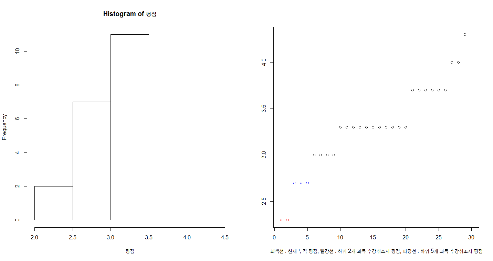

# Grade Cancel Effect

try simulating grade cancel effect for my sister


### \<List>

- [Grade Cancel Effect (2019.07.19)](#grade-cancel-effect-20190719)


## [Grade Cancel Effect (2019.07.19)](#list)
1) generate grade data (because my sister's real GPA can't be opened.ㅋㅋ)
2) plot

#### 1. generating grade data
```R
# 1.1 grade (4.3 Scale)
g0 <- 1:4
gp <- g0 + 0.3
gm <- g0 - 0.3
g <- sort(c(g0, gp, gm))
g
```
> 0.7 1.0 1.3 1.7 2.0 2.3 2.7 3.0 3.3 3.7 4.0 4.3

```R
# 1.2 more compact
g <- sort(c(1:4, 1:4+0.3, 1:4-0.3))
g
```
> 0.7 1.0 1.3 1.7 2.0 2.3 2.7 3.0 3.3 3.7 4.0 4.3

```R
# 1.3 test simply matching by slicing
g[9]
g[10]
g[9.5]
g[9.152346]
g[9.876312] # It works but calls values smaller (biased)
```
> 3.3  
> 3.7  
> 3.3  
> 3.3  
> 3.3

```R
# 1.4 generate random grade data
set.seed(307)
평점 <- g[rnorm(30, 9.5, 1.5)]
str(평점)
```
> num [1:30] 3.7 3 2.3 2.3 NA 3 3.7 3.3 3 3.3 ...

#### 2. plot
```R
len <- length(sort(평점))
windows(width=15, height=8)
  par(mfrow=c(1,2)) 
    hist(평점)
    plot(평점~rank(평점, ties.method="first"),
      xlab = "회색선 : 현재 누적 평점, 빨강선 : 하위 2개 과목 수강취소시 평점, 파랑선 : 하위 5개 과목 수강취소시 평점",
      ylab = "",
      col = c(rep(2,2), rep(4,3), rep(1,len-2-3))[rank(평점, ties.method="first")]
    )
      abline(h=mean((평점), na.rm=TRUE), col="gray")
      abline(h=mean(sort(평점)[3:len]), col="red")
      abline(h=mean(sort(평점)[6:len]), col="blue")
```



```R
# 2.1 values
mean(평점) # NA. na.rm=TRUE 넣어줘야 함
mean(평점, na.rm=TRUE)
mean(sort(평점)[6:len])
mean(sort(평점)[9:len])    
```
> NA  
> 3.293103  
> 3.45  
> 3.514286