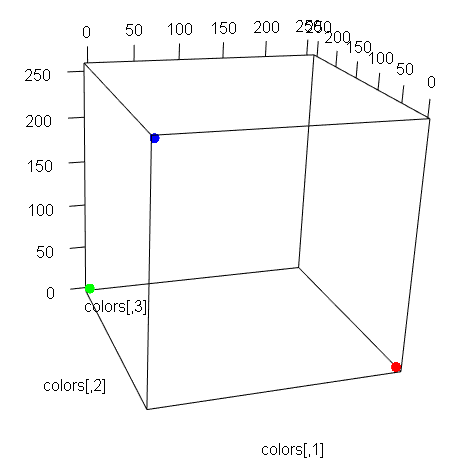
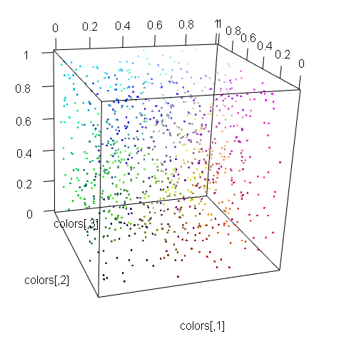
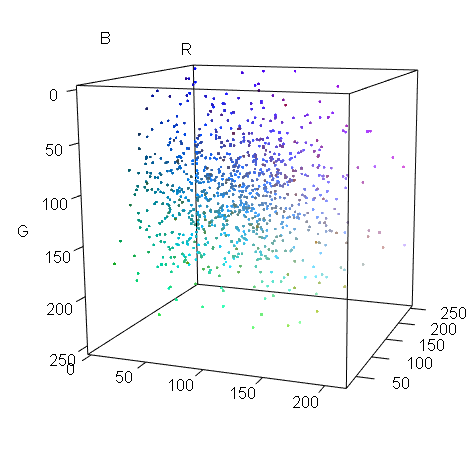
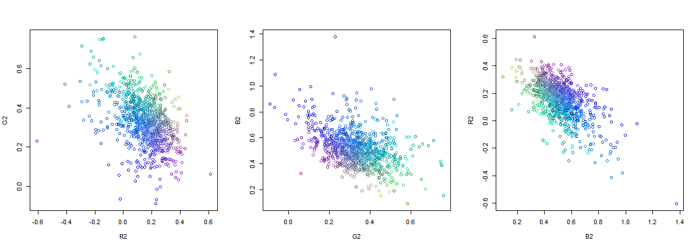
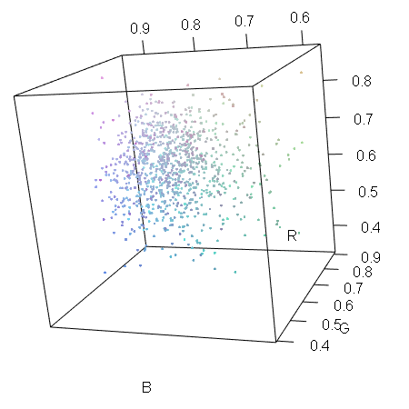
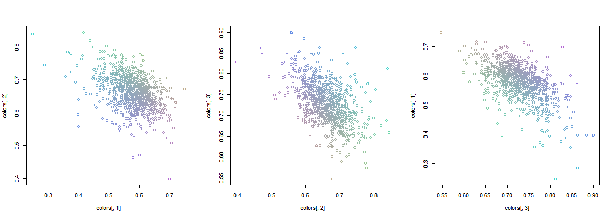

# RGB

&nbsp; Showing RGB color data' distribution by several methods in R


### \<List>

- [RGB (2017.04.14)](#rgb-20170414)


## [RGB (2017.04.14)](#list)

\* using `plot3d()`, converting on coordinate plane  
\* generating RGB data with a sigmoid function

```R
## Install required library packages (only at first)
install.packages("rgl")

## Loading required libraries
library(rgl)
```

#### 1. Input directly by c() function
```R
colors <- matrix(c(c(255,0,0),c(0,255,0),c(0,0,255)), ncol=3)
colors

plot3d(colors, size=10, col=rgb(colors/255))
```
&nbsp; \* '/255' : because rgb() requires values between 0 and 1.


#### 2. Generate sample data by Uniform dist.
```R
colors <- matrix(c(runif(3000)), ncol=3)
tail(colors)

plot3d(colors, col=rgb(colors))
```


#### 3. Generate sample data by somehow better(?) dist.
&nbsp; \* Frankly speaking, this was somewhat stupid work, but I did it.
```R
R <- rnorm(1000, 64, 50)
G <- rnorm(1000, 128, 50)
B <- rnorm(1000, 192, 50)
colors <- cbind(R,G,B)
tail(colors)

for (i in 1:1000) {
  for (j in 1:3) {
    if (colors[i,j]>255) {colors[i,j] = 255}
    else if (colors[i,j]<0) {colors[i,j] = 0}
  }
}

summary(colors)

plot3d(colors, col=rgb(colors/255))
```


#### 4. Convert ## 3.'s RGB to Yxy (Plotting on coordinate plane)
&nbsp; \* Reference : https://github.com/THEjoezack/ColorMine/blob/master/ColorMine/ColorSpaces/Conversions/YxyConverter.cs
```R
R2 = R/(R+G+B)
G2 = G/(R+G+B)
B2 = B/(R+G+B)

par(mfrow=c(1,3))
plot(R2, G2, col=rgb(colors/255))
plot(G2, B2, col=rgb(colors/255))
plot(B2, R2, col=rgb(colors/255))
```


#### 5. Using Sigmoid function
&nbsp; \* Reference : https://en.wikipedia.org/wiki/Sigmoid_function
```R
R <- rnorm(1000, 64, 50)
G <- rnorm(1000, 128, 50)
B <- rnorm(1000, 192, 50)

colors <- (tanh(cbind(R,G,B)/255)+1)/2
summary(colors)

plot3d(colors, col=rgb(colors))
```



#### 6. Using Sigmoid function 2 (Plotting on coordinate plane)
&nbsp; \* Reference : https://github.com/THEjoezack/ColorMine/blob/master/ColorMine/ColorSpaces/Conversions/YxyConverter.cs
```R
R2 = R/(R+G+B)
G2 = G/(R+G+B)
B2 = B/(R+G+B)

colors <- (tanh(cbind(R2,G2,B2))+1)/2
summary(colors)

par(mfrow=c(1,3))
plot(colors[,1], colors[,2], col=rgb(colors))
plot(colors[,2], colors[,3], col=rgb(colors))
plot(colors[,3], colors[,1], col=rgb(colors))
```

