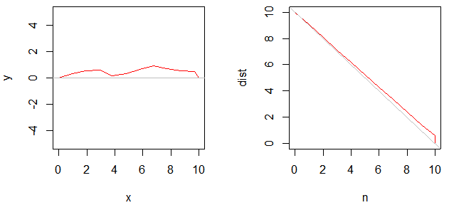

# Reach The Goal

Simulation how to reach the goal more efficiently


### \<List>

- [Reach The Goal 1 (2022.10.31)](#reach-the-goal-1-20221031)
- [Reach The Goal 0 (2022.10.31)](#reach-the-goal-0-20221031)


## [Reach The Goal 1 (2022.10.31)](#list)

- A trace to reach the goal dynamically and its plots

  

  <details>
    <summary>Codes</summary>

  #### `ReachTheGoal_1.r`
  ```R
  # 1. A trace to reach the goal dynamically

  x <- c(0)
  y <- c(0)
  n <- c(0)
  slope <- c()
  drt <- c()

  step <- 1
  err <- 45
  goal <- c(10, 0)
  dist <- c(10)

  for (i in 1:100) {
      n <- c(n, i)
      slope <- c(slope, (goal[2] - tail(y, 1)) / (goal[1] - tail(x, 1)))
      drt <- c(drt, atan(tail(slope, 1)) + runif(1, -err, err) * (dist/goal[1]))
      if (tail(x, 1) < goal[1] + step) {
          x <- c(x, tail(x, 1) + step * cos(tail(drt, 1)/180*pi))
          y <- c(y, tail(y, 1) + step * sin(tail(drt, 1)/180*pi))
      } else {
          x <- c(x, tail(x, 1) - step * cos(tail(drt, 1)/180*pi))
          y <- c(y, tail(y, 1) - step * sin(tail(drt, 1)/180*pi))
      }

      dist <- c(dist, sqrt((goal[1] - tail(x, 1))^2 + (goal[2] - tail(y, 1))^2))

      # test : sprintf() doesn't work in loop statement
      # sprintf("%2d : (slope) %2.2f, (direction) %2.2f, (x) %2.2f, (y) %2.2f, (distance) %2.2f", length(x), slope, drt, tail(x, 1), tail(y, 1), dist)

      if (tail(dist, 1) < 1) {
          n <- c(n, i)
          x <- c(x, goal[1])
          y <- c(y, goal[2])
          slope <- c(slope, (goal[2] - tail(y, 1)) / (goal[1] - tail(x, 1)))
          drt <- c(drt, atan(tail(slope, 1)))
          dist <- c(dist, sqrt((goal[1] - tail(x, 1))^2 + (goal[2] - tail(y, 1))^2))
          break
      }
  }
  ```
  ```R
  # 1.1 Plot

  windows(width = 7, height = 4)
  par(mfrow = c(1, 2))
  plot(x, y, pch = "", ylim = c(-5, 5))
  lines(x, y, col = "red")
  abline(h = 0, col = "gray")

  plot(n, dist, pch = "")
  lines(n, dist, col = "red")
  abline(a = goal[1], b = -1, col = "gray")
  ```
  </details>

## [Reach The Goal 0 (2022.10.31)](#list)

- Practice : Generate a 2d list with sublists that have different lengths to each other

  #### `ReachTheGoal_0.r`
  ```R
  myList <- list()
  for (i in 1:10) {
      myList <- c(myList, list(1:i))
  }
  ```

  <details>
    <summary>Results</summary>

    ```r
    head(myList)
    ```
    ```
    [[1]]
    [1] 1

    [[2]]
    [1] 1 2

    [[3]]
    [1] 1 2 3

    [[4]]
    [1] 1 2 3 4

    [[5]]
    [1] 1 2 3 4 5

    [[6]]
    [1] 1 2 3 4 5 6
    ```
    ```r
    myList[3]
    ```
    ```
    [[1]]
    [1] 1 2 3
    ```
    ```r
    myList[[3]]
    ```
    ```
    [1] 1 2 3
    ```
    >
  </details>