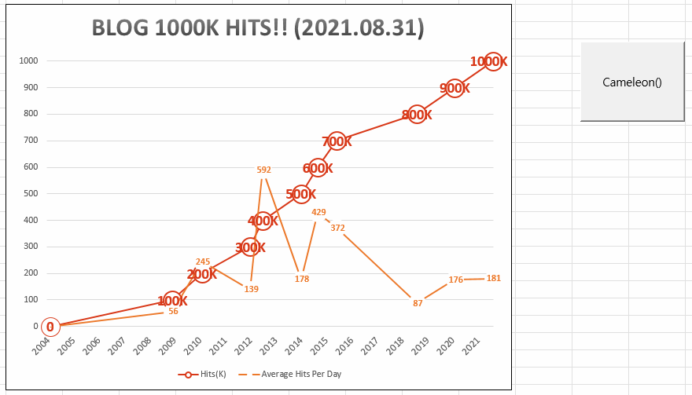

# Change Format in Excel

Excel with VBA is Fish with Water!


### \<List>

- [Find and Replace a Substring (2022.08.12)](#find-and-replace-a-substring-20220812)
- [Randomly Change the Format Colors of the Chart (2021.08.31)](#randomly-change-the-format-colors-of-the-chart-20210831)


## [Find and Replace a Substring (2022.08.12)](#list)

- Replace the substring's property partially, not the whole string's in the cell

  

  <details>
    <summary>Code : FindAndReplace.bas</summary>

    ```vba
    Option Explicit
    ```
    ```vba
    ' A sub procedure to find a substring in a cell and replace its color partially
    Sub FindAndReplace()

        ' Set variables
        Dim dataZero As Range                                   ' dataZero  : the zeropoint to start data
        Dim str As String                                       ' str       : the string to search
        Dim length As Integer                                   ' length    : the length of str
        Dim row As Integer                                      ' row       : the number of rows that contain data from dataZero

        Set dataZero = Range("A1")
        str = Range("D1").Value
        length = Len(str)
        With UsedRange
            row = Cells(Rows.Count, 1).End(xlUp).row - dataZero.row + 1
        End With

        ' Main operation : find the index of the target substring and replace its property
        Dim idx As Integer
        Dim r As Integer
        For r = 0 To row - 1
            idx = InStr(1, dataZero.Offset(r, 0), str)          ' idx == 0 means the target substring is absent
            If idx > 0 Then
                With dataZero.Offset(r, 0).Characters(Start:=idx, length:=length).Font
                    ' .Name = "맑은 고딕"
                    ' .FontStyle = "보통"
                    ' .Size = 11
                    ' .Strikethrough = False
                    ' .Superscript = False
                    ' .Subscript = False
                    ' .OutlineFont = False
                    ' .Shadow = False
                    ' .Underline = xlUnderlineStyleNone
                    .Color = RGB(255, 0, 0)                     ' RGB(255, 0, 0) : Red
                    ' .TintAndShade = 0
                    ' .ThemeFont = xlThemeFontMinor
                End With
            End If
        Next r

    End Sub
    ```
    ```vba
    ' Button to run FindAndReplace()
    Private Sub btnFindAndReplace_Click()

        Application.Calculation = xlManual                      ' make the following procedure run faster
            Call FindAndReplace
        Application.Calculation = xlAutomatic

    End Sub
    ```
    </details>


## [Randomly Change the Format Colors of the Chart (2021.08.31)](#list)

- Slow and changes only one line's format in the chart, anyway archive

  

  <details>
    <summary>Code : Cameleon.bas</summary>

  ```vba
  Option Explicit
  ```
  ```vba
  Sub Cameleon()

      Dim rnd1, rnd2, rnd3 As Integer
      Randomize
      rnd1 = Rnd * 255

      Worksheets(1).ChartObjects(1).Activate

      Dim i As Integer
      For i = 1 To 5

          rnd1 = (rnd1 * i) Mod 256
          rnd2 = (rnd1 * i) Mod 256
          rnd3 = (rnd2 * i) Mod 256

          Application.ScreenUpdating = False

          'Line
          ActiveChart.FullSeriesCollection(1).Select
          With Selection.Format.Line
              .ForeColor.RGB = RGB(rnd1, rnd2, rnd3)
              .Visible = msoTrue
              .Transparency = 0
          End With

          'Data Label
          ActiveChart.FullSeriesCollection(1).DataLabels.Select
          With Selection.Format.TextFrame2.TextRange.Font.Fill
              .ForeColor.RGB = RGB(rnd1, rnd2, rnd3)
              .Visible = msoTrue
              .Transparency = 0
              .Solid
          End With

          Application.ScreenUpdating = True

          Application.Wait Now + TimeValue("00:00:01")

      Next i

  End Sub
  ```
  </details>
