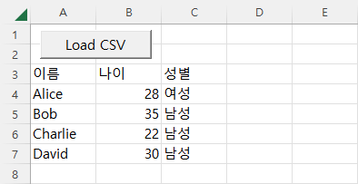

# [Load CSV (Excel VBA)](../../README.md#vba)

  Handling complex data structures that are not suitable to deal directly with VBA, save them to CSV using Python and then import them onto an Excel sheet.


### \<List>

  - [Load CSV (2023.08.04)](#load-csv-20230804)


## [Load CSV (2023.08.04)](#list)

  - Features : When the button on the Excel sheet is pressed, the following actions are executed.
    - `test_csv.csv` is generated using `save_csv.py`.
    - The above CSV file is loaded into VBA

  - Issues
    - Encoding issue was encountered and resolved by using `utf-8-sig` encoding at the Python stage.

  - Codes
    <details>
      <summary>Codes : save_csv.py</summary>

    ```py
    import csv
    ```
    ```py
    # 테스트용 2차원 배열 데이터 생성
    data = [
        ['이름', '나이', '성별'],
        ['Alice', 28, '여성'],
        ['Bob', 35, '남성'],
        ['Charlie', 22, '남성'],
        ['David', 30, '남성']
    ]

    # CSV 파일로 데이터 저장
    with open('test_csv.csv', 'w', newline='', encoding='utf-8-sig') as csvfile:    # utf-8-sig : 엑셀에서 한글 깨짐 현상 방지
        csvwriter = csv.writer(csvfile)
        csvwriter.writerows(data)

    print('CSV 파일 생성이 완료되었습니다.')
    ```
    </details>
    <details open="">
      <summary>Output : test_csv.csv</summary>

    ```csv
    이름,나이,성별
    Alice,28,여성
    Bob,35,남성
    Charlie,22,남성
    David,30,남성
    ```
    </details>
    <details>
      <summary>Codes : LoadCSV.bas</summary>

    ```vba
    Option Explicit
    ```
    ```vba
    Private pythonScriptPath    As String
    Private pythonExe           As String
    Private pythonArgs          As String
    Private csvFilePath         As String
    Private startCell           As Range
    ```
    ```vba
    ' 파라미터 설정 프로시저
    Private Sub SetParameters()

        ' 파이썬 스크립트의 경로 설정
        pythonScriptPath = ".\save_csv.py"

        ' 파이썬 실행 파일과 인자 설정
        pythonExe = "C:\Python\Python38-64\python.exe"                              ' 파이썬 실행 파일 경로
        pythonArgs = pythonScriptPath                                               ' 파이썬 스크립트 경로를 인자로 전달

        ' .csv 파일 저장 경로 설정 (파이썬 스크립트가 .csv 파일을 생성할 경로)
        csvFilePath = ".\test_csv.csv"

        ' 데이터를 불러올 시작 셀 지정
        Set startCell = ThisWorkbook.Sheets("LoadCSV").Range("A3")                  ' A3 셀부터 데이터를 불러옴

    End Sub
    ```
    ```vba
    ' 파이썬 스크립트 실행 프로시저
    Private Sub RunPythonScript()

        ' 파이썬 스크립트 실행
        Shell pythonExe & " " & pythonArgs

    End Sub
    ```
    ```vba
    ' CSV 파일 로드 및 붙여넣기 프로시저
    Private Sub LoadCSV()

        ' .csv 파일을 엑셀로 불러와서 시작 셀에 붙여넣기
        Workbooks.Open Filename:=csvFilePath
            ActiveSheet.UsedRange.Copy Destination:=startCell
        ActiveWorkbook.Close SaveChanges:=False

    End Sub
    ```
    ```vba
    ' 버튼 클릭 이벤트 프로시저
    Private Sub btn1_Click()

        Application.Calculation = xlManual

            Call SetParameters
            Call RunPythonScript
            Call LoadCSV

        Application.Calculation = xlAutomatic

    End Sub
    ```
    </details>
    <details open="">
      <summary>Output</summary>

    
    </details>
