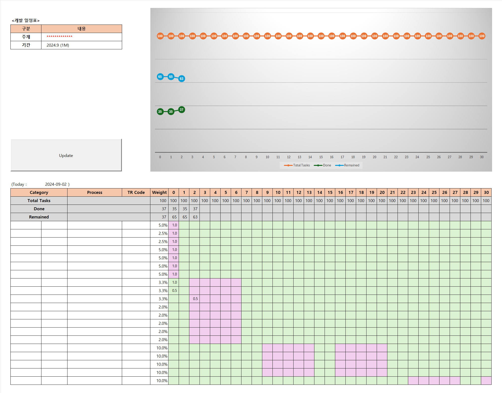
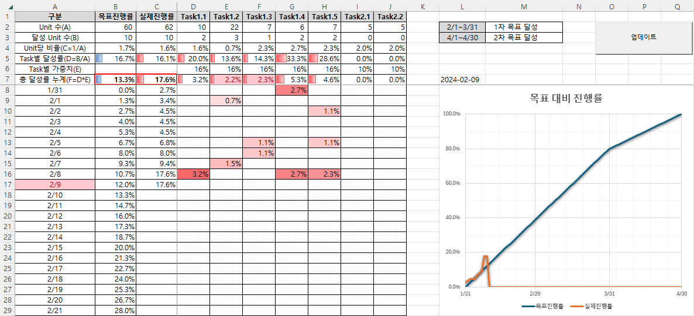
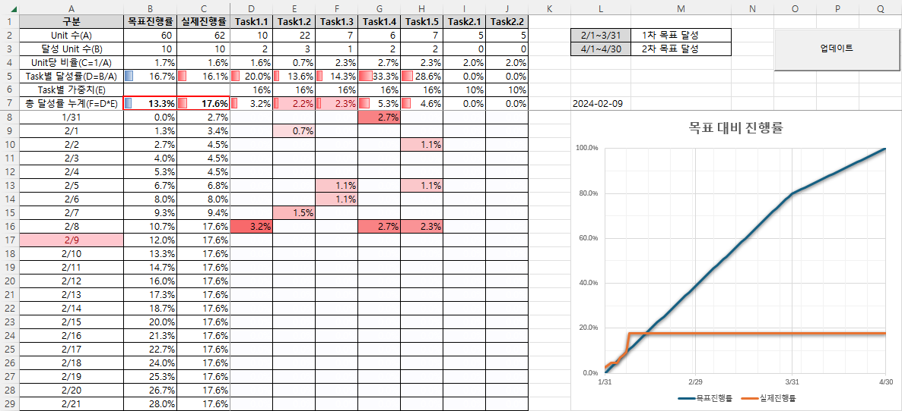

# [Progress Rate Tracker (Excel VBA)](../../README.md#vba)

  I want a prettier chart


### \<List>

  - [Progress Rate Tracker 2 (2024.09.02)](#progress-rate-tracker-2-20240902)
  - [Progress Rate Tracker (2024.02.09)](#progress-rate-tracker-20240209)


## [Progress Rate Tracker 2 (2024.09.02)](#list)

  - A **Burn-up chart** for a development plan (Not a continuously upgraded version from [Progress Rate Tracker (2024.02.09)](#progress-rate-tracker-20240209))
    - Calculates total, done, and remained rates for each day
      - Total rate: Calculate based on the weighted contribution of tasks with any progress indicated by cell color
    - Only updates done and remained rates up to the current day
  
    

  - Code : `ProgressRateTracker2.bas`
    <details>
      <summary>Headers and Constants</summary>

    ```vba
    Option Explicit
    ```
    ```vba
    ' Constants for the columns and rows used in the development plan tracking
    Private Const RATE_START_COL As String = "G"      ' Start column for the rate tracking
    Private Const RATE_END_COL As String = "AK"       ' End column for the rate tracking

    Private Const DAY_ROW As Long = 24                ' Row number where the day is stored
    Private Const TOTAL_ROW As Long = 25              ' Row number for total rate calculations
    Private Const DONE_ROW As Long = 26               ' Row number for done rate calculations
    Private Const REMAINED_ROW As Long = 27           ' Row number for remained rate calculations

    Private Const WEIGHT_COL As String = "F"          ' Column to determine the last row of data
    Private Const DATA_START_ROW As Long = 28         ' Row number where the data starts

    Private Const TODAY_LOC As String = "C23"         ' Cell location where the current day is stored
    ```
    </details>
    <details>
      <summary>UpdateValues()</summary>

    ```vba
    ' Subroutine to update the progress tracking values
    Private Sub UpdateValues()

        Dim rateStartColNum As Long                   ' Column number where rate tracking starts
        Dim rateEndColNum As Long                     ' Column number where rate tracking ends
        Dim updateRangeString As String               ' String to store the range for updates
        Dim dataLastRowNum As Long                    ' Last row number with data
        Dim currentDay As Long                        ' Current day extracted from TODAY_LOC

        ' Convert column letters to column numbers
        rateStartColNum = Range(RATE_START_COL & ":" & RATE_START_COL).Column
        rateEndColNum = Range(RATE_END_COL & ":" & RATE_END_COL).Column

        ' Define the range to be cleared before updating values
        updateRangeString = RATE_START_COL & DONE_ROW & ":" & RATE_END_COL & REMAINED_ROW
        Range(updateRangeString).ClearContents

        ' Find the last row of data in the WEIGHT_COL column
        dataLastRowNum = Cells(DATA_START_ROW, WEIGHT_COL).End(xlDown).Row

        ' Get the current day from the TODAY_LOC cell
        currentDay = Day(Range(TODAY_LOC).value)

        Dim col As Long
        ' Loop through each column between rateStartColNum and rateEndColNum
        For col = rateStartColNum To rateEndColNum
            ' Calculate total rate for the column
            Cells(TOTAL_ROW, col) = CalculateTotalRate(col, dataLastRowNum)

            ' Only calculate done and remained rates if the day is on or before the current day
            If Cells(DAY_ROW, col).value <= currentDay Then
                Cells(DONE_ROW, col) = CalculateDoneRate(col, rateStartColNum, dataLastRowNum)
                Cells(REMAINED_ROW, col) = CalculateRemainedRate(col, rateStartColNum, dataLastRowNum)
            End If
        Next col

    End Sub
    ```
    </details>
    <details>
      <summary>CalculateTotalRate()</summary>

    ```vba
    ' Function to calculate the total rate for a specific column
    ' Parameters:
    '   - col: Column number for which the total rate is calculated
    '   - lastRowNum: Last row number with data
    ' Returns:
    '   - The calculated total rate for the column
    Private Function CalculateTotalRate(col As Long, lastRowNum As Long) As Double

        Dim value As Double                           ' Stores the total rate value
        Dim rowNum As Long                            ' Row counter

        ' Loop through each row in the data range
        For rowNum = DATA_START_ROW To lastRowNum
            ' Only consider cells with background color (non-empty)
            If Cells(rowNum, col).Interior.ColorIndex > 0 Then
                value = value + Cells(rowNum, WEIGHT_COL).value * 100
            End If
        Next rowNum

        CalculateTotalRate = value

    End Function
    ```
    </details>
    <details>
      <summary>CalculateDoneRate()</summary>

    ```vba
    ' Function to calculate the done rate for a specific column
    ' Parameters:
    '   - col: Column number for which the done rate is calculated
    '   - startColNum: Column number where rate tracking starts
    '   - lastRowNum: Last row number with data
    ' Returns:
    '   - The calculated done rate for the column
    Private Function CalculateDoneRate(col As Long, startColNum As Long, lastRowNum As Long) As Double

        Dim value As Double                           ' Stores the done rate value

        ' Calculate the sum product of the weight and progress in the column
        value = WorksheetFunction.SumProduct( _
                    Range(Cells(DATA_START_ROW, WEIGHT_COL), Cells(lastRowNum, WEIGHT_COL)), _
                    Range(Cells(DATA_START_ROW, col), Cells(lastRowNum, col)) _
                ) * 100

        ' Add the done rate from the previous column if applicable
        If col > startColNum Then
            value = value + Cells(DONE_ROW, col - 1).value
        End If

        CalculateDoneRate = value

    End Function
    ```
    </details>
    <details>
      <summary>CalculateRemainedRate()</summary>

    ```vba
    ' Function to calculate the remained rate for a specific column
    ' Parameters:
    '   - col: Column number for which the remained rate is calculated
    '   - startColNum: Column number where rate tracking starts
    '   - lastRowNum: Last row number with data
    ' Returns:
    '   - The calculated remained rate for the column
    Private Function CalculateRemainedRate(col As Long, startColNum As Long, lastRowNum As Long) As Double

        Dim value As Double                           ' Stores the remained rate value

        ' Calculate the remained rate as the difference between total and done rates
        value = Cells(TOTAL_ROW, col).value - Cells(DONE_ROW, col).value

        CalculateRemainedRate = value

    End Function
    ```
    </details>
    <details>
      <summary>btnUpdate_Click()</summary>

    ```vba
    ' Subroutine called when the update button is clicked
    ' This subroutine changes Excel's calculation mode to manual before updating values
    ' for performance reasons and restores it back to automatic afterward.
    Private Sub btnUpdate_Click()
        Application.Calculation = xlManual            ' Set calculation to manual for performance
            Call UpdateValues
        Application.Calculation = xlAutomatic         ' Restore calculation to automatic

    End Sub
    ```
    </details>


## [Progress Rate Tracker (2024.02.09)](#list)

  - Features
    - Manage progress rate using a combination of Excel functions and VBA
    - Prevent `""` returned from excel formula from being regarded as `0` in the chart
    - ★ The cleanest handling of **magic literals** in my VBA coding history! ★
      ```vba
      Private Const START_ROW As Long = 8                         ' The starting row where data begins
      Private Const DATE_COLUMN As String = "A"                   ' The column letter for the date column
      Private Const RATE_COLUMN As String = "C"                   ' The column letter for the column where sum will be displayed
      Private Const DATA_START_COLUMN As String = "D"             ' The column letter where data starts
      Private Const DATA_END_COLUMN As String = "J"               ' The column letter where data ends
      ```

  - Output
    <details>
      <summary>Before</summary>

      `C9` : `=IF(TODAY()>=A9,SUM(D9:J9)+C8,"")`

      

      `C9` : `=SUM(D9:J9)+C8`

      
    </details>
    <details open="">
      <summary>After</summary>

      
    </details>

  - Future Improvements
    - Automatically update upon data input without a button click
    - Gather the calculation results into an array and write them on the sheet at once
    - Translate additional parts relying on Excel functions into VBA code

  - Codes
    <details>
      <summary>Codes : ProgressRateTracker.bas</summary>

    ```vba
    Option Explicit
    ```
    ```vba
    Private Const START_ROW As Long = 8                         ' The starting row where data begins
    Private Const DATE_COLUMN As String = "A"                   ' The column letter for the date column
    Private Const RATE_COLUMN As String = "C"                   ' The column letter for the column where sum will be displayed
    Private Const DATA_START_COLUMN As String = "D"             ' The column letter where data starts
    Private Const DATA_END_COLUMN As String = "J"               ' The column letter where data ends
    ```
    ```vba
    Private Sub UpdateSumValues()
        ' Summary: Main procedure to update the sums
        
        Dim ws As Worksheet                                     ' The current worksheet
        Dim lastRow As Long                                     ' The last row where data exists
        Dim rateRange As String                                 ' The range where sums will be displayed

        ' Set the current active sheet
        Set ws = ThisWorkbook.ActiveSheet

        ' Find the last row where data exists
        lastRow = ws.Cells(ws.Rows.Count, DATE_COLUMN).End(xlUp).Row

        ' Set and clear the range where sums will be displayed
        rateRange = RATE_COLUMN & START_ROW & ":" & RATE_COLUMN & lastRow
        ws.Range(rateRange).ClearContents

        ' Get the current date
        Dim currentDate As Date
        currentDate = Date

        ' Iterate through each row to calculate and assign sums
        Dim i As Long
        For i = START_ROW To lastRow
            If ws.Cells(i, DATE_COLUMN).Value <= currentDate Then
                Call CalculateAndAssignSum(ws, i)
            End If
        Next i

    End Sub
    ```
    ```vba
    Private Sub CalculateAndAssignSum(ws As Worksheet, rowNumber As Long)
        ' Summary: Procedure to calculate and assign sum for each row
        
        Dim sumValue As Double                                  ' Variable to store the sum value
        Dim dataRange As Range                                  ' Range where data exists

        ' Set the range where data exists
        Set dataRange = ws.Range(DATA_START_COLUMN & rowNumber & ":" & DATA_END_COLUMN & rowNumber)

        ' Calculate sum including sum from previous row if applicable
        If rowNumber > START_ROW Then
            sumValue = Application.WorksheetFunction.Sum(dataRange) + _
                      Application.WorksheetFunction.Sum(ws.Range(RATE_COLUMN & (rowNumber - 1)))
        Else
            ' Calculate sum excluding sum from previous row for the first row
            sumValue = Application.WorksheetFunction.Sum(dataRange)
        End If

        ' Assign the sum value to the respective column in the current row
        ws.Cells(rowNumber, RATE_COLUMN).Value = sumValue

    End Sub
    ```
    ```vba
    Private Sub btnUpdate_Click()
        ' Summary: Procedure called when the update button is clicked
        
        ' Change calculation to manual for performance improvement
        Application.Calculation = xlManual
            Call UpdateSumValues
        Application.Calculation = xlAutomatic

    End Sub
    ```
    </details>
