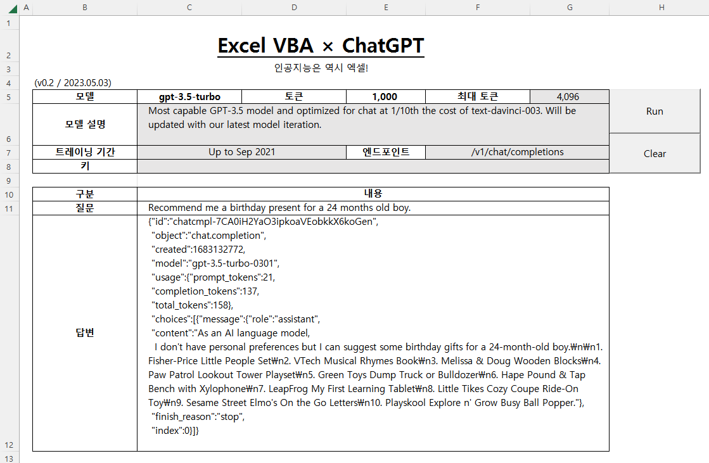

# [Q&A with ChatGPT (Excel VBA)](../../README.md#vba)

AI is definitely Excel material!


### \<List>

- [Q&A with ChatGPT v0.2 (2023.05.03)](#qa-with-chatgpt-v02-20230503)


## [Q&A with ChatGPT v0.2 (2023.05.03)](#list)

- Features
  - Succeed in obtaining responses for some models of the `/v1/chat/completions` endpoint.
  - Call the max token value, descrition, training period of the choosed model automatically (not with VBA, but with excel function `vlookup()`)

  

- Future Improvements
  - Resolve struggles with *JSON*
    - Extract and refine `content`
    - Print Korean characters properly
    - Output other parameters separately in individual cells
  - Support more various models that require different parameters to each other
  - Improve the speed of the feature that detects model changes and automatically adjusts the initial token value to be no greater than the maximum

- Where is the previous version? (crazy ad hoc documentation)  
  ☞ [Simple Q&A with ChatGPT : Trial (2023.05.02)](https://github.com/kimpro82/MyPractice/blob/master/VBA/README.md#simple-qa-with-chatgpt--trial-20230502)

- Codes
  <details open="">
    <summary>QAWithChatGPT_0.2.bas</summary>

  ```vba
  Option Explicit
  ```
  ```vba
  Private Type CellLocationsType

      model As String
      tokens As String
      maxTokens As String
      description As String
      trainingPeriod As String
      endpoint As String
      apiKey As String
      question As String

      ' Declare neither as String nor Integer but as Range
      modelRange As Range
      tokensRange As Range
      maxTokensRange As Range
      questionRange As Range
      answerRange As Range

  End Type
  ```
  ```vba
  Private Sub SetCellLocations(ByRef thisType As CellLocationsType)

      thisType.model = Range("C5").Value
      thisType.tokens = Range("E5").Value
      thisType.maxTokens = Range("G5").Value
      thisType.description = Range("C6").Value
      thisType.trainingPeriod = Range("C7").Value
      thisType.endpoint = Range("F7").Value
      thisType.apiKey = Range("C8").Value
      thisType.question = Range("C11").Value

      ' Don't forget `set`!
      Set thisType.modelRange = Range("C5")
      Set thisType.tokensRange = Range("E5")
      Set thisType.maxTokensRange = Range("G5")
      Set thisType.questionRange = Range("C11")
      Set thisType.answerRange = Range("C12")

  End Sub
  ```
  ```vba
  Private Sub ChatGPT()

      Dim CellLocations As CellLocationsType
      Dim request As Object
      Dim request_body As String
      Dim response As String

      ' Set required data
      Call SetCellLocations(CellLocations)

      ' Request ChatGPT API
      Set request = CreateObject("WinHttp.WinHttpRequest.5.1")
      request.Open "POST", "https://api.openai.com/" & CellLocations.endpoint, False
      request.SetRequestHeader "Content-Type", "application/json"
      request.SetRequestHeader "Authorization", "Bearer " & CellLocations.apiKey
      
  '    request_body = "{" & _
  '        """prompt"": """ & Replace(CellLocations.question, """", "\""") & """," & _
  '        """model"": """ & CellLocations.model & """," & _
  '        """max_tokens"": " & CInt(CellLocations.tokens) & "," & _
  '        """n"": 1," & _
  '        """stop"": [""\n""]" & _
  '    "}"

      request_body = "{" & _
          """model"": """ & CellLocations.model & """, " & _
          """messages"": [{" & _
              """role"": ""user"", " & _
              """content"": """ & Replace(CellLocations.question, """", "\""") & """" & _
          "}], " & _
          """max_tokens"": " & CInt(CellLocations.tokens) & ", " & _
          """n"": 1 " & _
      "}"
          Debug.Print "request_body = " & request_body
      request.send (request_body)
      
      ' Output
  '    response = Replace(request.responseText, Chr(34), "")
      response = Replace(request.responseText, ",", "," & Chr(10) & " ")
          Debug.Print "response = " & response & "\n"
      CellLocations.answerRange.Value = response

  End Sub
  ```
  ```vba
  ' But "surprisingly" late to use
  'Private Sub Worksheet_SelectionChange(ByVal Target As Range)
  '
  '    Dim CellLocations As CellLocationsType
  '    Call SetCellLocations(CellLocations)
  '
  '    If Not Intersect(CellLocations.modelRange, Target) Is Nothing Then
  '
  '        CellLocations.model = CellLocations.modelRange.Value
  '            Debug.Print "Changed in " & CellLocations.modelRange.Address & " : " & CellLocations.model
  '        CellLocations.maxTokens = CellLocations.maxTokensRange.Value
  '        If CInt(CellLocations.tokens) > CInt(CellLocations.maxTokens) Then
  '            CellLocations.tokensRange.Value = CellLocations.maxTokens           ' Set tokens = maxTokens as default
  '        End If
  '
  '    End If
  '
  'End Sub
  ```
  ```vba
  Private Sub btnRun_Click()

      Application.Calculation = xlManual

          Dim CellLocations As CellLocationsType
          Call SetCellLocations(CellLocations)

          If CellLocations.model = "" Then
              CellLocations.answerRange.Value = "모델을 선택해주세요."
          ElseIf CellLocations.question = "" Then
              CellLocations.answerRange.Value = "질문을 입력해주세요."
          ElseIf CellLocations.tokens = "" Then
              CellLocations.answerRange.Value = "토큰 수를 입력해주세요(< 최대 토큰)."
          ElseIf (CellLocations.maxTokens <> "auto") And _
              (CInt(CellLocations.tokens) > CInt(CellLocations.maxTokens)) Then
              CellLocations.answerRange.Value = "설정한 토큰 수가 최대 토큰 수보다 많습니다."
          Else
              Call ChatGPT
          End If
      
      Application.Calculation = xlAutomatic

  End Sub
  ```
  ```vba
  Private Sub btnClear_Click()

      Application.Calculation = xlManual

          Dim CellLocations As CellLocationsType
          Call SetCellLocations(CellLocations)

          CellLocations.modelRange.Value = ""
          CellLocations.tokensRange.Value = ""
          CellLocations.questionRange.Value = ""
          CellLocations.answerRange.Value = ""

      Application.Calculation = xlAutomatic

  End Sub
  ```
  </details>