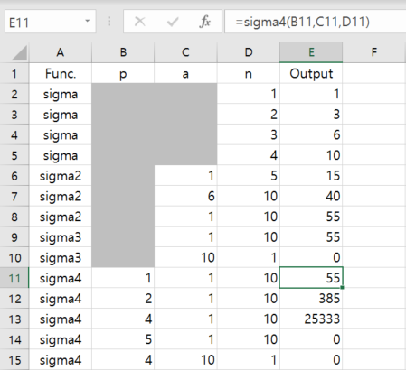
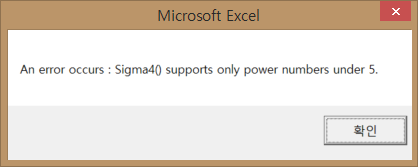
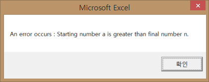
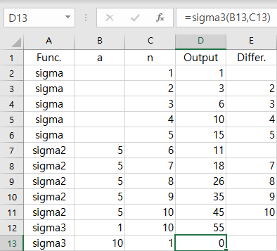
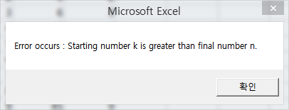
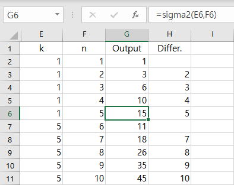
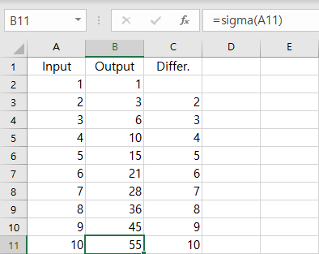

# Sigma

- Make a function to calculate `summation` (a.k.a. Sigma, Σ)


### \<List>

- [Sigma4 (2021.07.26)](#sigma4-20210726)
- [Sigma3 (2021.07.07)](#sigma3-20210707)
- [Sigma2 (2021.01.03)](#sigma2-20210103)
- [Sigma (2021.01.02)](#sigma-20210102)


## [Sigma4 (2021.07.26)](#my-vba-practice)

- Replace the calculation method from loop to **[Faulhaber's Formula](https://en.wikipedia.org/wiki/Faulhaber%27s_formula)** (make faster)
- Support operations for k ~ k^4







```vba
Option Explicit

Function Sigma4(p As Integer, a As Integer, n As Integer) As Integer

    On Error GoTo ErrorHandler1

        If a > n Then
            Err.Raise 380   'Error Code 380 : Invalid property value.
        End If

    On Error GoTo ErrorHandler2

        Dim sum As Integer

        If p = 1 Then
            sum = n * (n + 1) / 2 - (a - 1) * a / 2
        ElseIf p = 2 Then
            sum = n * (n + 1) * (2 * n + 1) / 6 - (a - 1) * a * (2 * (a - 1) + 1) / 6
        ElseIf p = 3 Then
            sum = (n * (n + 1) / 2) ^ 2 - ((a - 1) * a / 2) ^ 2
        ElseIf p = 4 Then
            sum = n * (n + 1) * (2 * n + 1) * (3 * n ^ 2 + 3 * n - 1) / 30 - (a - 1) * a * (2 * (a - 1) + 1) * (3 * (a - 1) ^ 2 + 3 * (a - 1) - 1) / 30
        Else                'When p > 4
            Err.Raise 380
        End If

        Sigma4 = sum
    
    Exit Function

    ErrorHandler1:

        MsgBox "An error occurs : Starting number a is greater than final number n."

    Exit Function

    ErrorHandler2:

        MsgBox "An error occurs : Sigma4() supports only power numbers under 5."

End Function
```


## [Sigma3 (2021.07.07)](#my-vba-practice)

- Add **Error Handler** 
- How about naming labels such like `try` ~ `catch` ~ `finally`?





```vba
Option Explicit


Function Sigma3(k As Integer, n As Integer) As Integer

    On Error GoTo ErrorHandler

    If k > n Then
        Err.Raise 380   'Error Code 380 : Invalid property value.
    End If

    Dim i As Integer, Sum As Integer

    For i = k To n      'including both of k and n
        Sum = Sum + i
    Next i

    Sigma3 = Sum
    
    Exit Function
    

ErrorHandler:
    
    MsgBox "Error occurs : Starting number k is greater than final number n."
    
End Function
```


## [Sigma2 (2021.01.03)](#my-vba-practice)

- Add a parameter of _k_ that indicates a starting point
- Need to add codes for handling errors.



```vba
Option Explicit


Function Sigma2(k As Integer, n As Integer) As Integer

    Dim i As Integer, Sum As Integer

    For i = k To n
        Sum = Sum + i
    Next i

    Sigma2 = Sum

End Function
```


## [Sigma (2021.01.02)](#my-vba-practice)

- Define all the variables as `integer`



```vba
Option Explicit


Function Sigma(n As Integer) As Integer

    Dim i As Integer, Sum As Integer

    For i = 1 To n
        Sum = Sum + i
    Next i

    Sigma = Sum

End Function
```